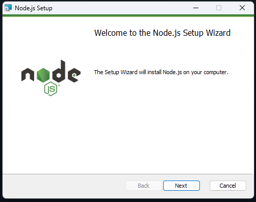
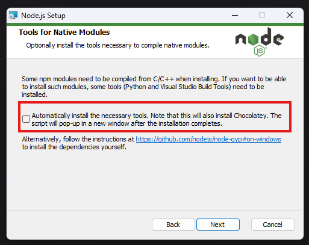

# TP : Jest

Dans ce TP nous allons dans un premier temps installer l'outil `node.js`. Cela nous permettra d'avoir accès au gestionnaire de paquet `npm`

Grâce à ce gestionnaire de paquets, nous pourrons par la suite intégrer `Jest` sur notre projet.


## Mise en place de l'environnement

### Etape 1 : Installation de node.js
Premièrement : rendez-vous sur ce lien : https://nodejs.org/en/download

Téléchargez le fichier `.msi`


::: tip
Attention, vous devez lancer l'installation en tant qu'administrateur
:::

 




::: tip
Ici, faites attention à bien décocher l'installation de Chocolatey, nous n'en avons pas besoin ! 
:::



### Etape 2 : Vérification de l'installation

Une fois l'installation réalisée, vous pouvez ouvrir une `invite de commande`.

Pour vérifier que node c'est correctement installé tapez la commande suivante : 

``` bash
node -v
```

Si le résultat est `v20.XX.XX` alors vous pouvez aller à l'étape suivante. Sinon, contactez le professeur.

À présent, vous pouvez taper la commande suivante : 

``` bash
npm -v
```

Comme pour avant, si vous avez un numéro de version qui est affiché, alors l'installation est correctement réalisée. Sinon, contactez le professeur.

### Etape 3 : Installer `Jest` dans votre projet

Allez dans votre dossier où vous souhaitez mettre votre TP.
Ouvrez une `invite de commande` dans ce dossier.

::: tip
Petite **astuce** : Pour ouvrir rapidement l'invite de commande directement dans le bon répertoire, vous pouvez écrire `cmd` dans la barre de recherche de l'explorateur de fichier : 


:::

Executez la commande d'installation de `Jest`

```bash
npm install jest
```

Des fichiers se sont crée dans votre dossier. C'est **normal !**. 
L'architecture de votre dossier devrait ressembler à ça : 

``` bash
.
├─ 📁 node_modules
├─ package.json
├─ package-lock.json
```

Vous pouvez créer ici votre fichier `.html` et vos fichier `.js`

::: tip
Votre environnement de travail est à présent prêt pour faire le TP

:::


## Travaux pratiques

Pour ce TP, l'objectif vas être de reprendre les fonctions réalisé pour les deux derniers TP sur les tests unitaires.

Crée un nouveau fichier `fonction.js` qui reprend l'ensemble des fonctions que vous avez crée dans les 2 derniers TP : 


    
Normalement vous devriez avoir `9 fonctions`
##### TP 01
* `addition(a, b)`
* `estMajeur(age)`
* `max(a, b)`
* `attribuerMention(score)`
* `verifierAcces(role, abonnementActif)`
  
##### TP 02
* `sommeTableau(tableau)`
* `nombresPairs(tableau)`
* `compterOccurrences(tableau, element)`
* `trouverMinMax(tab)`

A présent créez **UN FICHIER** pour chaque fonction. Par exemple pour tester la fonction `addition(a, b)`, il faut créer le fichier : `addition.test.js`

